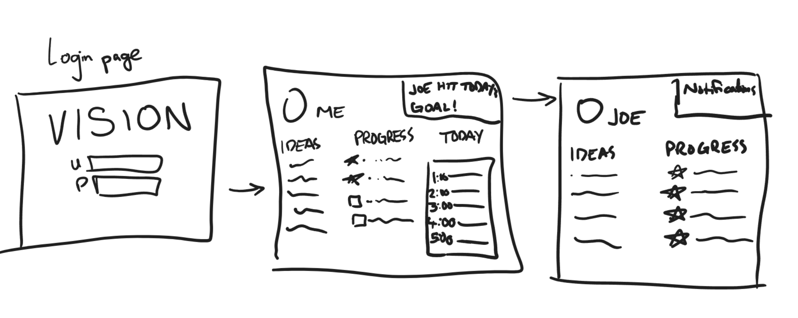

# startup: Vision
https://startup.quesadillasmith.net
(Website no longer active)

## React
- `create-react-app` used
- Multiple functional components: login/logout, user profile idea list
- React router used
- React hooks: useState for authentication and user profile ideas

## Websocket
- Backend: peerProxy.js
- Frontend: userpage.js now has websocket methods
- Data sent: Subtask progress. When the box is checked, the socket sends an update to all other users.
- Data displayed: Subtask progress. When the update is received, the notifications box lights up and adds to its dropdown.

## Login
- New user: 'create' button
- Existing user: 'log in' button
- Database access (MongoDB) now either happens at login or through secure router authtoken

## Database
- Create user adds to database
- All input boxes on the user profile and user info pages add to database
- Login retrieves person data from database

## Service Endpoints
- HTTP service using Node.js and Express
  - index.html comes through Express
  - Backend endpoints: add person, get person, add attribute
  - Frontend calls them with fetch
- Your frontend calls third party service endpoints
  - Quote on the user profile. 

## JS Deliverable
- (CSS styling ironed out and unified between pages)
- Login: username is saved to localStorage
- Database: Most info in localStorage will go to a database. Logout deletes local storage. 
- Websocket: Nothing changed, but I like having notifications in a dropdown instead of in a popup. So the websocket can go there.
- Interaction logic: mostly information-based, so the foregoing overlaps with this.

## CSS Deliverable
- Header, footer, main. Accomplished on most of the pages.
- Navigation elements done.
- Responsive to resizing, partially done.
- Elements, text, and images styled (not complete styling yet)

## HTML Deliverable
Structure done been done!
- HTML pages - Three HTML pages: login, home page for the user, info page for the user, and one goal partner page.
- Links - The login button ("Take charge of your future") links to the user's page. The notification links to the partner's page. The user info page links to partner's page. Profile link persists in partner page.
- Text - Text is used to describe the person to whom a page applies, notifications, and the info table (ideas, progress, today)
- 3rd party web service - Calendar portion, possibly the login as well.
- Images - Website logo and profile pictures
- Login - Input box and submit button for login.
- Database - Personal goal info (ideas, progress, and daily calendar), profile information, and goal partner connections draw from database.
- WebSocket - The notification box represents real-time updates on partners' goals.
## The pitch

Toward the end of 2020, I joked with my family about a New Year's resolution: eat a quesadilla every day. I got some positive responses, so I started thinking more about it. I thought "Oh what the heck." So I did it. A _different_ quesadilla every day. I owe the success largely to friends on Instagram for keeping me accountable. Unfortunately, Instagram isn't actively designed for goal accountability, so I haven't gone back to do anything quite like it. I'm imagining a social media platform built for this. Built for dreamers to put the dreaming spark out there, and built for dreamers to have a committed support network. What would the world be like? People would dream, and the dreams would come true.

## The design
### Features
- HTTPS login
- Persistent database
  - Friend network
  - Goal ideas
  - Goals in progress
  - Goals quit
- Notifications: friends achieving goals/milestones
- Person page displaying goal ideas, goals in progress, and today's calendar (use an imported web service)

### Technologies
1. HTML: Two correctly structured html pages, one for login and one for a person's goal page
2. CSS: Look pretty (careful with screen size, logo, theme)
3. Javascript: Login interaction, person page navigation, goal entry
4. Service: login, calendar
5. DB: person login, friend network, goal ideas/progress
6. Login: secure db storage
7. WebSocket: progress notifications from friends
8. React: Application --> react framework

### Sketch

## General to-do list:
- Real partners, search bar
- Get real calendar in there
- Notifications both hover and click
- Login enter key
- Input box products should be removable
- Individual profile pics
- Remove url no-logout loophole
- Expiring authtoken

## General wishlist
- Round profile pictures
- Common icons
- Take email off until it's needed
